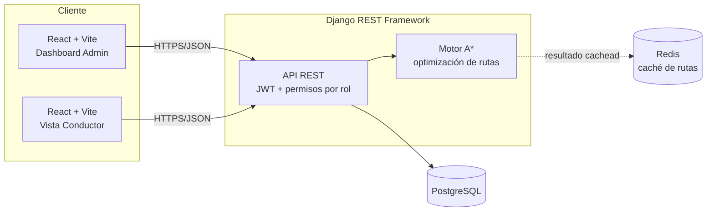

# NexusRoute

[](https://github.com/Dukeeee21/NexusRoute/actions/workflows/ci.yml)


Sistema inteligente de gestión logística y optimización de flotas. NexusRoute asigna
entregas a una flota de vehículos calculando la ruta más eficiente con el algoritmo
**A\***, y ofrece un panel centralizado para el dispatcher junto con una vista liviana
para cada conductor.

---

## Índice

- [Arquitectura](#arquitectura)
- [Stack tecnológico](#stack-tecnológico)
- [Inicio rápido (Docker)](#inicio-rápido-docker)
- [Desarrollo local sin Docker](#desarrollo-local-sin-docker)
- [Variables de entorno](#variables-de-entorno)
- [Documentación de la API](#documentación-de-la-api)
- [Testing y calidad](#testing-y-calidad)
- [Estructura del proyecto](#estructura-del-proyecto)
- [Roadmap de desarrollo](#roadmap-de-desarrollo)

---

## Arquitectura



- **Admin (Dispatcher)**: dashboard, CRUD de entregas/vehículos, asignación de rutas
  con mapa interactivo, reportes de rendimiento.
- **Conductor**: ve únicamente su ruta del día y actualiza el estado de cada parada.
  Sin reportes ni métricas de flota — interfaz liviana a propósito.
- El **motor de rutas** (`backend/apps/routes/algorithms/astar.py`) es un módulo
  Python puro, sin dependencias de Django, que resuelve el orden óptimo de visita
  con A* y heurística de árbol de expansión mínima (MST) — ver
  [docs/CALIDAD_ISO25010.md](docs/CALIDAD_ISO25010.md) para el detalle de por qué
  esto garantiza la ruta óptima, no una aproximación.
- Las distancias vienen de **OSRM** (ruteo real por calles, sobre OpenStreetMap),
  con **fallback automático** a distancia en línea recta si OSRM no responde —
  nunca se rompe la petición, y la respuesta siempre indica cuál se usó
  (`routing_source: "OSRM" | "HAVERSINE"`).

## Stack tecnológico

| Capa | Tecnología |
|---|---|
| Backend | Django 5 + Django REST Framework, JWT (`simplejwt`) |
| Base de datos | PostgreSQL 16 |
| Caché | Redis 7 (resultados de optimización de rutas) |
| Frontend | React 18 + Vite + Tailwind CSS |
| Mapas | Leaflet / OpenStreetMap |
| Gráficos | Chart.js |
| Documentación de API | drf-spectacular (OpenAPI/Swagger) |
| Infraestructura | Docker Compose |
| CI | GitHub Actions |

## Inicio rápido (Docker)

Requisitos: Docker Desktop.

```bash
git clone https://github.com/Dukeeee21/NexusRoute.git
cd NexusRoute
cp .env.example .env
docker compose up -d
```

Esto levanta 4 servicios (PostgreSQL, Redis, backend, frontend), aplica las
migraciones automáticamente y deja el stack corriendo. Para tener datos con los que
probar de inmediato (un admin, dos conductores, un vehículo y cinco entregas
pendientes):

```bash
docker compose exec backend python manage.py seed_demo_data
```

Después abrí:

| | URL | Credenciales |
|---|---|---|
| Dashboard (Admin) | http://localhost:5173 | `admin` / `admin12345` |
| Vista Conductor | http://localhost:5173 | `conductor1` / `driver12345` |
| API (Swagger) | http://localhost:8000/api/docs/ | — |
| Django Admin | http://localhost:8000/admin/ | `admin` / `admin12345` |

## Desarrollo local sin Docker

Backend (requiere Python 3.12 y PostgreSQL/Redis accesibles):

```bash
cd backend
python -m venv .venv && .venv\Scripts\activate   # o source .venv/bin/activate en Linux/Mac
pip install -r requirements/dev.txt
python manage.py migrate
python manage.py runserver
```

Frontend:

```bash
cd frontend
npm install
npm run dev
```

## Variables de entorno

Ver [.env.example](.env.example) para la lista completa. Nunca commitear un archivo
`.env` real — está excluido en `.gitignore`. Además de esas variables, el origen por
defecto de las rutas (el "depósito") es configurable de forma opcional vía
`DEPOT_LAT`, `DEPOT_LNG` y `DEPOT_LABEL` (ver `backend/config/settings/base.py`).

## Documentación de la API

Con el backend corriendo, la documentación interactiva (OpenAPI/Swagger) está en
**http://localhost:8000/api/docs/** — generada automáticamente desde el código con
`drf-spectacular`, siempre sincronizada con los endpoints reales.

## Testing y calidad

```bash
cd backend
pytest                                          # tests + reporte de cobertura
flake8 apps config conftest.py                  # estilo + complejidad ciclomática
isort --check apps config conftest.py           # orden de imports
black --check apps config conftest.py           # formato
```

- **100% de cobertura de líneas** sobre `apps/` y `config/` (63 tests).
- CI (`.github/workflows/ci.yml`) corre estos mismos chequeos en cada push/PR contra
  `main`/`develop`, con PostgreSQL y Redis reales como servicios — no mocks.
- El detalle completo de calidad (explicabilidad de las rutas, mitigación de riesgos
  de fallos, y qué se verificó de forma honesta vs. qué requeriría infraestructura
  adicional como un servidor SonarQube) está en
  [docs/CALIDAD_ISO25010.md](docs/CALIDAD_ISO25010.md).

## Estructura del proyecto

```
NexusRoute/
├── backend/
│   ├── apps/
│   │   ├── users/       # autenticación JWT, roles (ADMIN/DRIVER)
│   │   ├── deliveries/  # paquetes y entregas
│   │   ├── vehicles/    # flota
│   │   ├── routes/      # algoritmo A* + asignación de rutas
│   │   └── reports/     # KPIs y exportación CSV (solo admin)
│   └── config/           # settings (base/dev/prod), urls
├── frontend/
│   └── src/
│       ├── pages/admin/   # Dashboard, Entregas, Vehículos, Rutas, Reportes
│       ├── pages/driver/  # Vista del conductor
│       └── components/    # mapa, gráficos, formularios, badges de estado
├── docs/
│   └── CALIDAD_ISO25010.md
└── docker-compose.yml
```

## Roadmap de desarrollo

El proyecto se construyó en 8 fases incrementales, cada una mergeada a `main` de
forma independiente:

| Fase | Contenido |
|---|---|
| 1 | Fundación, autenticación JWT, roles |
| 2 | Modelos de dominio y CRUD de entregas/vehículos |
| 3 | Motor de optimización de rutas (A*) |
| 4 | Panel admin con mapa interactivo y asignación de rutas |
| 5 | Interfaz del conductor y simulación de seguimiento |
| 6 | Módulo de reportes de rendimiento (solo admin) |
| 7 | Testing y calidad (ISO/IEC 25010) |
| 8 | CI/CD y documentación final |
